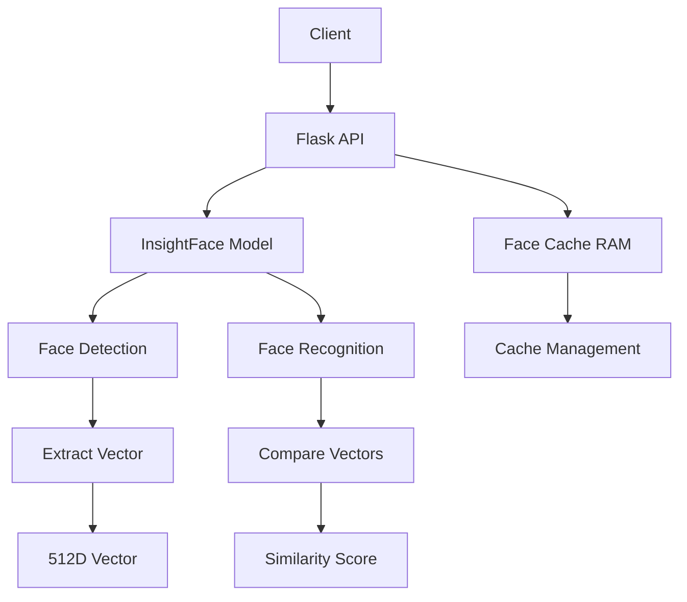

# 🤖 Face API - Hướng dẫn chi tiết

## 📋 Tổng quan

Face API là một REST API được xây dựng bằng Flask và InsightFace để:
- **Trích xuất vector khuôn mặt** từ ảnh qua URL
- **Nhận diện khuôn mặt** từ file upload
- **Quản lý cache** khuôn mặt trong RAM
- **Auto-load cache** từ server khi khởi động

### 🔧 Công nghệ sử dụng
- **Flask**: Web framework
- **InsightFace**: Face recognition model
- **OpenCV**: Image processing
- **ONNX Runtime**: Model inference
- **NumPy**: Numerical computing

## 🚀 Cài đặt và chạy

### 1. Chuẩn bị môi trường

```bash
# Clone/Download project
cd face-python-php-v2

# Tạo virtual environment (nếu chưa có)
python -m venv venv

# Kích hoạt virtual environment
venv\Scripts\Activate.ps1

# Cài đặt dependencies
pip install -r requirements.txt
```

### 1.1. Sử dụng venv ở đường dẫn tuyệt đối

```bash
# Tạo venv ở đường dẫn tuyệt đối
python -m venv "E:\Python_Environments\face_api_env"

# Kích hoạt venv từ đường dẫn tuyệt đối
"E:\Python_Environments\face_api_env\Scripts\Activate.ps1"

# Cài đặt dependencies
pip install -r requirements.txt
```

### 1.2. Tạo script chạy nhanh

**Tạo file `run_api.ps1`:**
```powershell
# Activate venv
& "E:\Python_Environments\face_api_env\Scripts\Activate.ps1"

# Start API
Write-Host "🚀 Starting Face API..." -ForegroundColor Green
python face_api.py
```

**Chạy:**
```bash
.\run_api.ps1
```

### 2. Chạy API Server

```bash
# Kích hoạt venv và chạy server
venv\Scripts\Activate.ps1 ; python face_api.py
```

**Output mong đợi:**
```
🔄 Loading face list from server...
✅ Successfully loaded 5 face vectors
💾 Face cache initialized with 5 entries
🚀 Starting Face API server...
Loading InsightFace model...
* Running on all addresses (0.0.0.0)
* Running on http://127.0.0.1:5000
* Running on http://[your-ip]:5000
```

### 3. Kiểm tra server

```bash
# Test server đang chạy
curl http://localhost:5000/
```

## 📡 API Endpoints

### 1. 🔍 GET_FACE_VECTOR
Trích xuất vector khuôn mặt từ URL ảnh

**Endpoint:** `POST /get_face_vector`

**Request:**
```json
{
  "image_link": "https://example.com/image.jpg"
}
```

**Response thành công:**
```json
{
  "status": "success",
  "vector": [0.1, 0.2, ..., 0.5]  // 512 chiều
}
```

**Response lỗi:**
```json
{
  "status": "fail",
  "vector": [],
  "error": "No face detected"
}
```

**Ví dụ sử dụng:**
```python
import requests

url = "http://localhost:5000/get_face_vector"
data = {
    "image_link": "https://example.com/photo.jpg"
}

response = requests.post(url, json=data)
result = response.json()

if result["status"] == "success":
    vector = result["vector"]
    print(f"Vector length: {len(vector)}")
```

### 2. 👤 DETECT_FACE
Nhận diện khuôn mặt từ file upload

**Endpoint:** `POST /detect_face`

**Request:**
```http
POST /detect_face
Content-Type: multipart/form-data

file: <image_file>
```

**Response thành công:**
```json
{
  "status": "success",
  "data": {
    "id": "user123",
    "url_confirm": "https://example.com/confirm"
  }
}
```

**Response lỗi:**
```json
{
  "status": "fail",
  "data": null,
  "error": "No face detected"
}
```

**Ví dụ sử dụng:**
```python
import requests

url = "http://localhost:5000/detect_face"

with open("photo.jpg", "rb") as f:
    files = {"file": ("photo.jpg", f, "image/jpeg")}
    response = requests.post(url, files=files)

result = response.json()
if result["status"] == "success":
    user_id = result["data"]["id"]
    print(f"Detected user: {user_id}")
```

### 3. 📝 UPDATE_FACE
Cập nhật cache khuôn mặt (manual)

**Endpoint:** `POST /update_face`

**Request:**
```json
{
  "face_array": [
    {
      "id": "user1",
      "name": "Nguyen Van A",
      "face": [0.1, 0.2, ..., 0.5],  // 512 chiều
      "url_confirm": "https://example.com/confirm1"
    },
    {
      "id": "user2",
      "name": "Tran Thi B", 
      "face": [0.3, 0.4, ..., 0.6],  // 512 chiều
      "url_confirm": "https://example.com/confirm2"
    }
  ]
}
```

**Response:**
```json
{
  "status": "success"
}
```

**Ví dụ sử dụng:**
```python
import requests

url = "http://localhost:5000/update_face"
data = {
    "face_array": [
        {
            "id": "user001",
            "name": "John Doe",
            "face": [0.1] * 512,  # Vector 512 chiều
            "url_confirm": "https://example.com/confirm"
        }
    ]
}

response = requests.post(url, json=data)
result = response.json()
print(result["status"])
```

### 4. 🔄 RELOAD_FACE_CACHE
Reload cache từ server

**Endpoint:** `POST /reload_face_cache`

**Request:** Không cần body

**Response:**
```json
{
  "status": "success",
  "message": "Face cache reloaded with 5 entries"
}
```

**Ví dụ sử dụng:**
```python
import requests

url = "http://localhost:5000/reload_face_cache"
response = requests.post(url)
result = response.json()
print(result["message"])
```

### 5. 📊 CACHE_STATUS
Kiểm tra trạng thái cache

**Endpoint:** `GET /cache_status`

**Response:**
```json
{
  "status": "success",
  "data": {
    "total_entries": 5,
    "entries": [
      {"id": "1", "name": "Lê Văn A"},
      {"id": "2", "name": "Nguyễn thị B"}
    ]
  }
}
```

**Ví dụ sử dụng:**
```python
import requests

url = "http://localhost:5000/cache_status"
response = requests.get(url)
result = response.json()
print(f"Cache có {result['data']['total_entries']} entries")
```

## 🔧 Cấu hình và tùy chỉnh

### 1. Model Configuration

```python
# face_api.py - dòng 16-21
face_analyzer = FaceAnalysis(
    name='buffalo_l',                    # Model name
    allowed_modules=['detection', 'recognition'],  # Modules
    providers=['CPUExecutionProvider']   # Execution provider
)
face_analyzer.prepare(
    ctx_id=0,           # Context ID
    det_thresh=0.4,     # Detection threshold
    det_size=(640, 640) # Detection size
)
```

### 2. Server Configuration

```python
# face_api.py - dòng 139
app.run(
    host='0.0.0.0',  # Bind to all interfaces
    port=5000,       # Port number
    debug=True       # Debug mode
)
```

### 3. Face List URL Configuration

```python
# face_api.py - dòng 16
FACE_LIST_URL = "https://events.dav.edu.vn/tool1/_site/event_mng/galaxy_face_detection/get-face-vector.php"
```

**Để thay đổi URL server:**
```python
# Thay đổi URL trong face_api.py
FACE_LIST_URL = "https://your-server.com/api/face-list"
```

### 4. Similarity Threshold

```python
# face_api.py - trong hàm find_best_match
def find_best_match(query_embedding, cache, threshold=0.5):
    # threshold: Ngưỡng tương đồng (0.0 - 1.0)
    # Giá trị cao hơn = khớp chặt chẽ hơn
```

## 🏗️ Architecture Overview



### Workflow chính:

1. **Initialization**: Load face cache từ server
2. **Model Loading**: Load InsightFace model
3. **Face Detection**: Detect faces in image
4. **Feature Extraction**: Extract 512D vector
5. **Face Recognition**: Compare with cached vectors
6. **Result**: Return matched identity or "unknown"

## 📂 Cấu trúc thư mục

```
face-python-php-v2/
├── face_api.py              # Main API server
├── requirements.txt         # Dependencies
├── venv/                   # Virtual environment
├── tam_thoi/               # Temp folder (auto-created)
├── test_face_api.py        # Comprehensive tests
├── simple_test.py          # Simple tests
├── test_face_cache.py      # Face cache tests
├── test_curl.ps1           # PowerShell tests
├── GUIDE_face_api.md       # This guide
└── GUIDE_test_api.md       # Test guide
```

## 💾 Cache Management

### Cache Structure:
```python
face_cache = [
    {
        "id": "user123",
        "name": "John Doe", 
        "face": [0.1, 0.2, ..., 0.5],  # 512D vector
        "url_confirm": "https://example.com/confirm"
    },
    # ... more entries
]
```

### Cache Operations:
- **Auto-load**: Tự động load khi khởi động từ server
- **Manual load**: `POST /update_face`
- **Reload**: `POST /reload_face_cache`
- **Status**: `GET /cache_status`
- **Search**: Cosine similarity matching
- **Clear**: Replace entire cache
- **Thread-safe**: Using `threading.Lock`

### Server API Format:
Server cần trả về format như sau:
```json
{
  "status": "success",
  "data": [
    {
      "id": 1,
      "name": "Lê Văn A",
      "face": "[-0.01176952,0.030987497,...]",  // JSON string
      "url_confirm": "http://example.com/confirm/1",
      "mtime": "2023-10-01 12:00:00",
      "image_path": "/images/john_doe.jpg"
    }
  ]
}
```

## 🔒 Security Considerations

### 1. Input Validation
- URL validation for image links
- File type validation for uploads
- Vector dimension validation (512D)

### 2. Rate Limiting
```python
# Thêm vào face_api.py nếu cần
from flask_limiter import Limiter
from flask_limiter.util import get_remote_address

limiter = Limiter(
    app,
    key_func=get_remote_address,
    default_limits=["200 per day", "50 per hour"]
)
```

### 3. CORS Configuration
```python
# Thêm vào face_api.py nếu cần
from flask_cors import CORS

CORS(app, origins=["http://localhost:3000"])
```

## 🚨 Error Handling

### Common Error Codes:

| Error | Code | Description |
|-------|------|-------------|
| Missing file | 400 | No file uploaded |
| Invalid format | 400 | Invalid request format |
| No face detected | 200 | No face found in image |
| Network error | 500 | Image download failed |
| Model error | 500 | InsightFace processing failed |

### Error Response Format:
```json
{
  "status": "fail",
  "error": "Error description",
  "data": null
}
```

## 🔧 Troubleshooting

### 1. Server không khởi động
```bash
# Kiểm tra port
netstat -an | findstr :5000

# Kiểm tra Python
python --version

# Kiểm tra dependencies
pip list
```

### 2. Model không load
```bash
# Kiểm tra ONNX Runtime
python -c "import onnxruntime; print('OK')"

# Kiểm tra InsightFace
python -c "import insightface; print('OK')"
```

### 3. Memory issues
```python
# Giảm model size
face_analyzer = FaceAnalysis(
    name='buffalo_s',  # Smaller model
    providers=['CPUExecutionProvider']
)
```

### 4. Slow performance
```python
# Sử dụng GPU (nếu có)
face_analyzer = FaceAnalysis(
    providers=['CUDAExecutionProvider', 'CPUExecutionProvider']
)
```

## 📈 Performance Optimization

### 1. Model Optimization
- Sử dụng model nhỏ hơn (`buffalo_s` vs `buffalo_l`)
- Enable GPU acceleration
- Adjust detection threshold

### 2. Cache Optimization
- Limit cache size
- Implement TTL (Time To Live)
- Use database instead of RAM

### 3. Image Processing
- Resize images before processing
- Use async processing
- Implement image caching

## 🔄 Integration Examples

### 1. với Frontend (JavaScript)
```javascript
// Upload file
const formData = new FormData();
formData.append('file', fileInput.files[0]);

fetch('http://localhost:5000/detect_face', {
    method: 'POST',
    body: formData
})
.then(response => response.json())
.then(data => {
    if (data.status === 'success') {
        console.log('Detected:', data.data.id);
    }
});
```

### 2. với Mobile App (React Native)
```javascript
const detectFace = async (imageUri) => {
    const formData = new FormData();
    formData.append('file', {
        uri: imageUri,
        type: 'image/jpeg',
        name: 'photo.jpg'
    });

    const response = await fetch('http://your-ip:5000/detect_face', {
        method: 'POST',
        body: formData,
        headers: {
            'Content-Type': 'multipart/form-data'
        }
    });

    return response.json();
};
```

### 3. với PHP Backend
```php
<?php
// Detect face
$ch = curl_init();
curl_setopt($ch, CURLOPT_URL, 'http://localhost:5000/detect_face');
curl_setopt($ch, CURLOPT_POST, true);
curl_setopt($ch, CURLOPT_POSTFIELDS, [
    'file' => new CURLFile($imagePath)
]);
curl_setopt($ch, CURLOPT_RETURNTRANSFER, true);

$response = curl_exec($ch);
$data = json_decode($response, true);

if ($data['status'] === 'success') {
    echo "Detected: " . $data['data']['id'];
}
curl_close($ch);
?>
```

## 📊 Monitoring và Logging

### 1. Basic Logging
```python
import logging

logging.basicConfig(
    level=logging.INFO,
    format='%(asctime)s - %(levelname)s - %(message)s'
)

# Trong API handlers
logging.info(f"Processing image from {image_link}")
logging.error(f"Face detection failed: {str(e)}")
```

### 2. Performance Monitoring
```python
import time

def monitor_performance(func):
    def wrapper(*args, **kwargs):
        start_time = time.time()
        result = func(*args, **kwargs)
        end_time = time.time()
        logging.info(f"{func.__name__} took {end_time - start_time:.2f}s")
        return result
    return wrapper
```

## 🔮 Future Enhancements

### 1. Database Integration
- Persistent face storage
- User management
- Audit logging

### 2. Advanced Features
- Face verification (1:1 matching)
- Age/gender detection
- Face mask detection
- Emotion recognition

### 3. Scalability
- Load balancing
- Redis caching
- Message queues
- Microservices architecture

## 💡 Best Practices

### 1. Development
- Use virtual environment
- Version control dependencies
- Write comprehensive tests
- Document API changes

### 2. Production
- Use production WSGI server (Gunicorn)
- Implement proper logging
- Set up monitoring
- Use HTTPS

### 3. Security
- Validate all inputs
- Implement rate limiting
- Use authentication
- Sanitize file uploads

## 📞 Support

### Resources:
- **InsightFace Documentation**: https://github.com/deepinsight/insightface
- **Flask Documentation**: https://flask.palletsprojects.com/
- **OpenCV Documentation**: https://docs.opencv.org/

### Common Issues:
1. **ONNX Runtime error**: Install correct version
2. **Memory issues**: Use smaller model
3. **Slow performance**: Enable GPU acceleration
4. **Network timeout**: Increase timeout settings

---

🎉 **Chúc bạn sử dụng Face API thành công!** 

Nếu có vấn đề gì, hãy kiểm tra logs và tham khảo phần troubleshooting. 